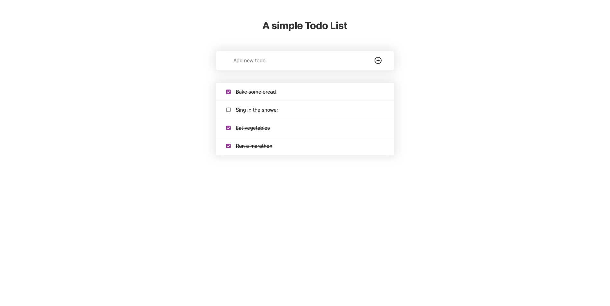

# Todo App

A simple todo list

---

<div align="center">



[Live Preview](https://giuxtaposition.github.io/todo-app/)

</div>

---

## Get started

Install the dependencies...

```bash
cd todo-app
yarn install
```

...then start [Rollup](https://rollupjs.org):

```bash
yarn dev
```

Navigate to [localhost:8080](http://localhost:8080).

## Building and running in production mode

To create an optimized version of the app:

```bash
yarn build
```

You can run the newly built app with `yarn start`.
